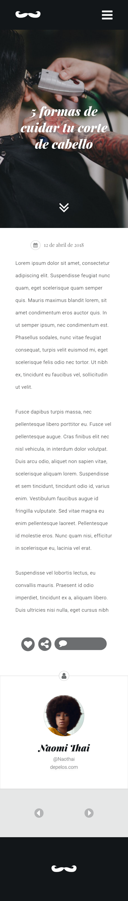
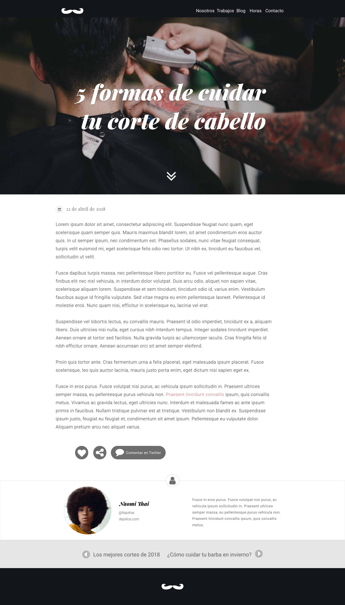

# Maquetación - Front End B-learning

## Maquetando una entrada de blog

### Instrucciones: 

Recrea el siguiente [mockup](img/barbershop-desktop.png) de una entrada de blog utilizando todos los conceptos, herramientas y metodologías aprendidas en los cursos previos.

### Requsitos generales:

- Primero revisa la [guía de estilo](img/guia-de-estilos-barbershop.png).
	-	En ella encontrarás los colores, fuentes, iconos e imágenes usados en el mockup.
	-	Los archivos se encuentran en el siguiente [link](assets).
-  Luego, define qué dependencias utilizarás para crear la página web.
-	La página deberá contener:
	- Una barra de navegación
	- Un header
	- Una entrada
	- El perfil del autor del artículo
	- Una barra con flechas que permitan ir a las entradas anteriores y siguientes
	- Un footer

Recuerda que la página web deberá ser responsiva. Toma como referencia el siguiente [mockup](img/barbershop-mobile.png) con la versión móvil.

### Criterios de evaluación:

- Uso de dependencias específicas para la página web
- Utilización de BEM en clases CSS
- Buenas prácticas y uso de identado correcto
- Uso de media queries
- Uso de GIT para versionar el desafío
- Uso de Github Pages
- Creación del repositorio con el desafío
- Creación de README.md con link de página web subida a Github Pages
- Entrega del desafío a través de la plataforma desafío

Luego debes enviar los cambios (vía push) y subir el link del repositorio a la sección correspondiente en la plataforma [empieza](https://empieza.desafiolatam.com "Desafío Latam").

Mucha suerte!